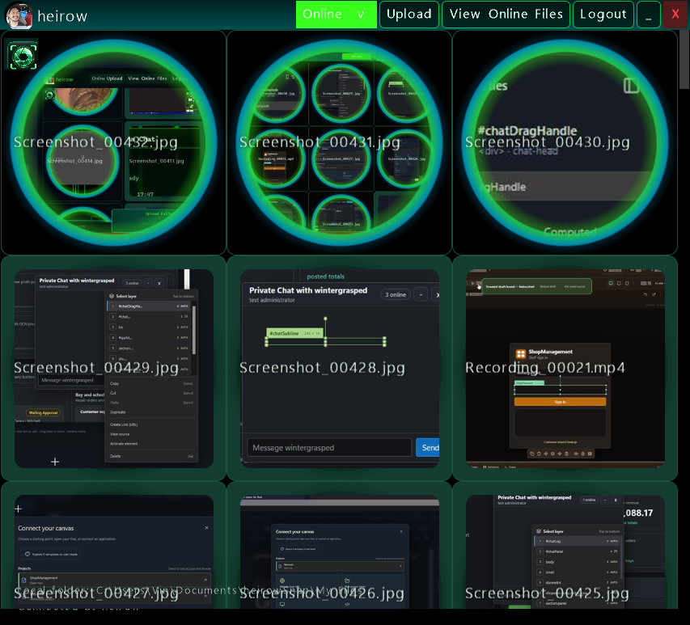
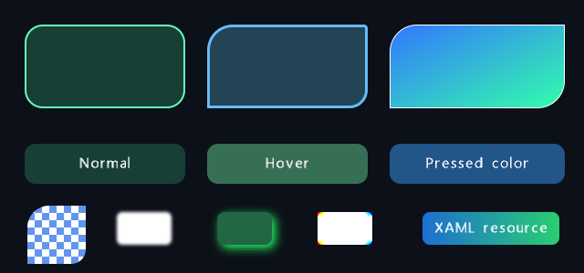
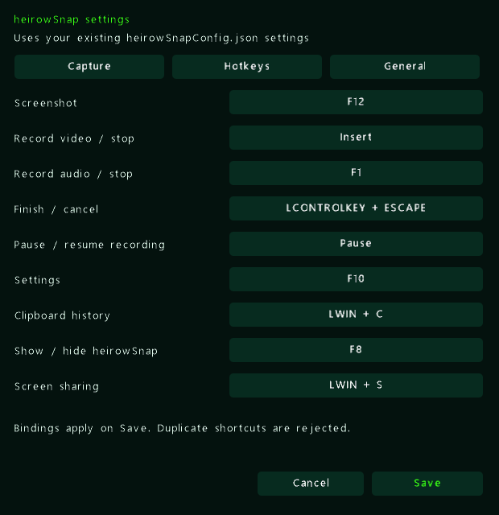
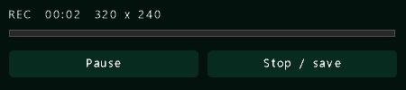

# Project Z

### Familiar XAML. Native DirectX 12. Your UI, accelerated.

Build expressive desktop tools, creative applications, and game interfaces with a GPU-rendered scene system and a WPF-inspired programming model.


**[Showcase](#heirowsnap-built-with-project-z) · [Port your UI](#bring-your-xaml) · [Get started](#run-it-from-source) · [Technical reference](docs/FEATURES.md)**



*heirowSnap, ported to Project Z: original XAML styling brought into a native DX12 scene.*

## A new generation of Project Z

The renderer has moved from KNI to **MonoGame 3.8.5.1's native DirectX 12 backend**, retaining the familiar `Microsoft.Xna.Framework` drawing API. This update brings the pieces needed to move a real desktop UI: resources, styles, shaders, animation, scaled input, media, and native tool windows.

| New capability | What you can build with it |
| :--- | :--- |
| **Native DX12 renderer** | Hardware-rendered scenes, reusable render targets, FXAA, synchronized viewport resizing, and a build-selectable DX11 fallback. |
| **XAML UI porting** | Import existing windows, named controls, resource dictionaries, and item templates into native elements. Generate VB event scaffolding from XAML. |
| **XAML shader support** | GPU blur, shadows, inversion, and chromatic effects on controls and subtrees, with animatable effect properties. |
| **XAML animations** | Storyboards, double/color keyframes, discrete corner-radius keyframes, easing, repeating tracks, and load/hover/click triggers. |
| **Desktop input with scaling** | Mouse buttons, drag, hover, wheel, keyboard and editable text, with native client-to-render coordinate mapping and transformed hit testing. |
| **Richer layout and styling** | Grid, Canvas, WrapPanel, DockPanel, UniformGrid, kinetic scrolling, independent rounded corners, gradients, masks, and resource-based styles. |
| **Inline audio/video** | Video frames rendered as scene textures, synchronized audio, play/pause/seek, looping, clipping, and bounded decode size. |
| **3D inside your UI** | XYZW meshes, cameras, materials, OBJ/FBX models, textures, wireframe, and custom shaders through `Surface3DElement`. |
| **Desktop integration** | Borderless/resizable windows, DWM composition requests, shared-device tool windows, tray menus, hotkeys, notifications, and capture workflows in heirowSnap. |
| **Creative tooling** | Native DX12 VST3 editor with DX11 fallback, granular synthesis, MIDI, XAML design surface, and plugin deployment tooling. |

> **Source preview:** these features describe this source update relative to published `master` at `e01a0ae`. The NuGet package may lag behind; build from source for the DX12 feature set.

## heirowSnap built with Project Z

The port brings an existing WPF application's linked XAML and theme resources into Project Z scenes, while native code connects account, file, chat, clipboard, and capture workflows.

### Your theme, carried across



*Native surfaces, gradient brushes, state styling, and GPU effects.*

### A complete desktop settings surface



*Project Z controls, tabs, shortcuts, and the existing settings model.*



*Small windows share the same visual language: recording controls, notifications, settings, and tray surfaces.*

- **Files and media:** local/online galleries, streaming uploads, drag-and-drop, asynchronous video thumbnails, inline playback, and Recycle Bin-confirmed deletion.
- **People and conversations:** presence, contact menus, chat windows, and wire-compatible SocketJack protocol models.
- **Clipboard:** persistent history, search, filtering, sorting, and a configurable global shortcut.
- **Capture:** screenshots, video/audio recording, pause/resume, region indicators, audio levels, and native recording controls.
- **Desktop polish:** same-process settings, custom tray menus, animated notifications, and preservation of existing configuration fields.

These are real development captures of the port and its DX12 graphics probe. They illustrate rendering and local UI; remote calling and streaming require separate two-client validation. [Capture provenance](Images/showcase/README.md).

## Bring your XAML

### 1. Keep your markup and theme

Link existing `.xaml` files and resource dictionaries into your app's output. heirowSnap links them directly from its original source tree, keeping the original UI files available to both applications.

### 2. Import the window into a scene

Inside an initialized Project Z scene:

```vb
Imports ProjectZ.Shared.Drawing.Designer
Imports ProjectZ.Shared.Drawing.UI.Input

SceneXamlParser.RegisterApplicationResources("UI\Theme.xaml")

Dim importer As New SceneXamlParser(Me)
Dim root = importer.ParseLegacyWindow("UI\MainWindow.xaml")
AddElement(root)

Dim save = importer.FindName(Of Button)("SaveButton")
If save IsNot Nothing Then
    AddHandler save.MouseLeftClick, Sub(point) SaveSettings()
End If

For Each feature In importer.UnsupportedFeatures
    System.Diagnostics.Debug.WriteLine(feature)
Next
```

`SaveSettings()` is your application handler; paths are relative to the working directory. Use `ParseFile` for scene markup, `ParseNamedElement` for a single control, or `ParseItemTemplate` for repeated items. `RegisterFactory` maps custom controls to native implementations.

### 3. Connect the behavior

The code generator creates named-element fields and event scaffolding for documents with `x:Class`, preserving code inside its designated custom-code region:

```powershell
dotnet run --project "Project Z XAML Codegen" -- "MyApp\UI" "MyApp\Generated"
```

**Keep the UI; adapt the application logic.** Supported controls and styles import directly. WPF code-behind, arbitrary bindings, complex templates, and custom controls may need adapters. Review `UnsupportedFeatures` and generated compatibility notes. This is a supported XAML subset, not a full WPF runtime.

## Style it. Shade it. Animate it.

### Familiar XAML, native effects

```xml
<Border xmlns="http://schemas.microsoft.com/winfx/2006/xaml/presentation"
        Width="320" Height="100" CornerRadius="18"
        Background="#103D30" BorderBrush="#35E7C4" BorderThickness="1">
    <Border.Effect>
        <DropShadowEffect Color="#35E7C4" BlurRadius="16"
                          ShadowDepth="3" Opacity="0.65" />
    </Border.Effect>
    <TextBlock Text="Hello, native DX12" Foreground="White" />
</Border>
```

Application and merged dictionaries, local overrides, `BasedOn` styles, solid brushes, and linear/radial gradients carry your visual language across controls. Rounded surfaces support independent corner radii and antialiased edges; buttons retain normal, hover, and pressed brushes.

Effects capture subtrees into reusable GPU render targets and respect ancestor scroll clipping. Storyboards can animate blur radius, shadow depth, opacity, color, and chromatic amount. `RegisterEffectAdapter` extends the mappings.

The supported WPFPixelShaderLibrary inversion and linear/spastic chromatic adapters use the original shader calculations. Generic chromatic effects and WPF box blur use approximations. Arbitrary compiled WPF `.ps` files are not automatically converted. [Shader details and licensing](docs/FEATURES.md#xaml-resource-brushes-and-effects).

### Motion stays in the markup

```xml
<Grid xmlns="http://schemas.microsoft.com/winfx/2006/xaml/presentation"
      xmlns:x="http://schemas.microsoft.com/winfx/2006/xaml">
    <Grid.Resources>
        <Storyboard x:Key="Reveal">
            <DoubleAnimation Storyboard.TargetName="Card"
                             Storyboard.TargetProperty="Opacity"
                             From="0" To="1" Duration="0:0:0.35" />
        </Storyboard>
    </Grid.Resources>
    <Border x:Name="Card" Width="320" Height="100"
            Background="#103D30" CornerRadius="18" />
</Grid>
```

After parsing and attaching the tree, call `importer.BeginStoryboard("Reveal")` from the scene's event/update path. Imported `Loaded`, `MouseEnter`, `MouseLeave`, and click triggers can also start storyboards. Keyframes, spline/easing interpolation, repeating tracks, scale/translation targets, and effect properties support richer transitions. heirowSnap notifications use imported load, hover, and click animations.

## Input that follows the UI

Native mouse coordinates map into render coordinates during resizing and across monitor scale changes. Parent transforms, visibility, and clipping participate in hit testing, keeping interaction aligned with the rendered control.

- Left/right clicks, movement, hover, dragging, and wheel routing through nested controls.
- Keyboard press/release and repeat, editable text, selection, clipboard shortcuts, and password input.
- Kinetic scrolling with bounded impulses, time-based deceleration, and edge stopping.
- Native tool-window input forwarded into the shared scene renderer.

This covers desktop mouse/keyboard input; touch, pen, IME, and accessibility-provider parity are not implied.

## Run it from source

Use **Windows, the .NET 8 SDK, and a DX12-capable GPU/driver**. Windows apps target x64 by default. Visual Studio 2022 can open `Project Z.sln`.

```powershell
# Build the framework. Native DX12 is the default.
dotnet build "Project Z Windows.vbproj" -c Release

# Run the application demo.
dotnet run --project "Project Z Application\Project Z Application (Windows).vbproj" -c Release

# Select the DX11 migration fallback.
dotnet build "Project Z Windows.vbproj" -c Release -p:ProjectZGraphicsBackend=DirectX11
```

The build restores the pinned MGFXC tool and compiles XAML shaders for the selected backend. Edit `Resources/XamlEffects.fx`; generated binaries belong under `obj`.

**For heirowSnap**, provide the original wShare checkout. `WShareRoot` defaults to `%USERPROFILE%\source\repos\wShare`; legacy settings also references `InputHelper.dll` in the adjacent AI.NET output. See the [project file](heirowSnap%20Legacy%20Settings/heirowSnap%20Legacy%20Settings.vbproj) for the expected path.

```powershell
dotnet build "heirowSnap Project Z\heirowSnap Project Z.vbproj" -c Release -p:WShareRoot="C:\src\wShare"
dotnet run --project "heirowSnap Project Z\heirowSnap Project Z.vbproj" -c Release --no-build
```

Network workflows need a configured service/account; recording and thumbnail workflows need FFmpeg. For the published package separately: `dotnet add package ProjectZ`.

## Explore the solution

| Project / area | Purpose |
| :--- | :--- |
| `Project Z Windows.vbproj` | Scene graph, controls, layout, input, animations, XAML, and rendering. |
| `heirowSnap Project Z` | Desktop port and practical integration example. |
| `heirowSnap Protocol` / `heirowSnap Legacy Settings` | Network models and linked settings implementation. |
| `Project Z XAML Codegen` | XAML-to-VB named-control and event scaffolding. |
| `Project Z Model Import` | Assimp-backed model import for 3D surfaces. |
| `Project Z VST` / `Project Z VST SmokeHost` | Granular synthesizer, native editor, and embedded-host checks. |
| `Project Z Application` | UI demo and playable Tetris. |
| `Project Z Audio` / `Project Z Video FX` | Audio analysis and reactive visuals. |
| `Project Z Tower Defense` | Networked game and WPF-hosted designer. |
| `ProjectTemplate` | Application starting point. |

## Go deeper

- [Backends, composition, inline video, and 3D](docs/FEATURES.md#graphics-backends-and-3d-surfaces)
- [Rounded corners, XAML resources, and effects](docs/FEATURES.md#rounded-xaml-surfaces)
- [Desktop integration and focused smoke checks](docs/FEATURES.md#heirowsnap-desktop-integration)
- [VST3 editor and deployment](Project%20Z%20VST/README.md)
- [Third-party notices](THIRD-PARTY-NOTICES.md)

Contributions and reproducible issues are welcome. For rendering problems, include the backend, GPU/driver, display scaling, and a small XAML example.

---

**Project Z · Declarative UI with a native GPU canvas.**

Built with MonoGame, .NET, SocketJack, and the libraries in [third-party notices](THIRD-PARTY-NOTICES.md). Imported WPFPixelShaderLibrary adapters include GPL-3.0 material; review the notices and bundled license before redistribution.
